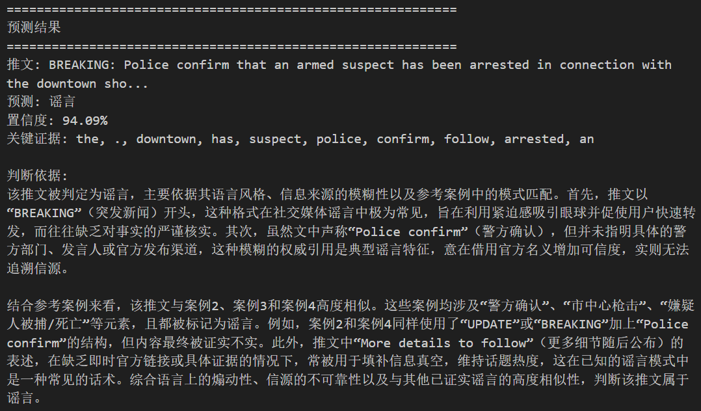

# 2026《人工智能导论》大作业报告

---

**任务名称：** RumorDetection——可解释性的谣言检测系统

**完成组号：** 5组

**小组人员：** 
廖耕雨-524031910787-nunglaanha
路茗淳-523031910592-lumingchun123
袁昌昊-524031910163-ecqz
龙凯峰-524031910174-LOONGKF

**完成时间：** 2026-06-17


## 1. 任务目标与背景分析

### 1.1 任务背景

社交媒体的高速传播特性使得谣言能在短时间内触达大量用户，对公共舆论和社会信任造成严重危害。传统的人工审核方式面临信息量大、时效性要求高、主观判断不一致等挑战，因此各种自动化的谣言检测手段应运而生。然而，现有基于深度学习的分类模型往往以"黑箱"方式给出判断结果，缺乏可解释性，审核人员难以评估模型决策的可信度，也无法基于模型输出进行二次人工校验。因此，构建一个既具备高精度分类能力，又能提供透明判断依据的可解释谣言检测系统，成为当前的重要研究方向。

### 1.2 任务目标

构建一个**可解释的社交媒体谣言检测系统**，在给出谣言/非谣言分类结果的同时，输出模型做出判断的自然语言依据。具体包括：

- **分类任务**：基于预训练语言模型（BERT-large）对英文推文进行微调二分类，实现高精度的谣言/非谣言自动判别；
- **案例检索**：引入稠密检索增强生成（RAG）机制，通过语义匹配从训练集中检索相似历史案例作为辅助判断依据；
- **解释生成**：调用大语言模型（LLM），将预测结果、关键证据词、参考案例整合为连贯的中文解释文本，从语言风格、信息来源、事实核查、上下文分析和逻辑推理五个维度给出判断理由；
- **整体目标**：兼顾分类准确率与可解释性，为社交媒体内容审核提供可信的AI辅助工具，使审核人员能够基于模型提供的证据链进行快速决策。


## 2. 方案设计

系统整体采用"分类—检索—解释"三阶段串联架构。整体架构示意图如下：


*图1：系统架构示意图*

### 2.1 数据预处理

原始训练集包含2840条英文推文，经数据清洗后保留2791条有效样本。清洗流程为：将URL替换为`[URL]`标记、将@mention替换为`[USER]`标记、保留hashtag作为语义特征、排除重复文本及标签冲突样本。清洗后数据按80/20划分为训练集（2232条）和验证集（559条）。

### 2.2 阶段一：BERT微调分类

使用 `bert-large-uncased` 预训练模型作为编码器，在其pooler输出后接 Dropout(0.1) → Linear(1024, 2) 分类头，对推文进行谣言/非谣言二分类。训练阶段采用AdamW优化器（学习率约4.2e-5、权重衰减约0.06），配合余弦预热学习率调度（预热比例约18%）和标签平滑（ε=0.1）策略，设置早停机制（patience=3）防止过拟合。超参数通过Optuna框架的TPE采样器自动搜索获得。前向传播时设置 `output_attentions=True` 获取最后一层多头注意力权重，对[CLS] token在所有注意力头上的权重取平均，排除特殊token后提取top-10高关注度词作为关键证据，实现分类决策的可追溯性。

### 2.3 阶段二：RAG相似案例检索

使用 `all-MiniLM-L6-v2` sentence-transformer模型将全部训练集文本预编码为384维稠密向量，构建FAISS IndexFlatL2索引并缓存至本地。推理时对输入文本实时编码，以L2距离衡量语义相似度，检索top-5最相似的训练样本及其真实标签，在为LLM生成可解释性依据时提供历史案例参照。

### 2.4 阶段三：LLM解释生成

将推文原文、预测标签、置信度、关键证据词和检索案例拼接为结构化提示词，调用用交大本地部署的 `qwen3.5-27b` 大模型API生成中文自然语言判断依据。

## 3. 核心代码分析

项目代码位于 `src/` 目录，按功能模块化组织，各模块职责清晰：

| 模块 | 代码文件 | 核心功能 |
|:---:|:-------:|:--------:|
| 数据处理 | `data_processor.py` | 文本清洗（去URL/@）、分词、构建DataLoader |
| BERT分类 | `bert_classifier.py` | BERT→Dropout→Linear分类头，注意力提取 |
| 训练 | `train.py` | AdamW优化、余弦预热、早停机制 |
| 稠密检索 | `dense_retriever.py` | SentenceTransformer编码、FAISS索引、top-5检索 |
| 解释生成 | `llm_explainer.py` | 构造Prompt、调用LLM API、失败降级方案 |
| 推理引擎 | `inference.py` | 三阶段串联、批量推理、结果保存 |
| 流水线 | `pipeline.py` | CLI入口（train/eval/predict） |
| 超参搜索 | `tune.py` | Optuna 自动搜索 batch size / lr / weight decay / warmup |
| 配置 | `config.py` | 统一管理路径、超参数、API配置 |

核心代码分析如下：

- **BERT分类器**（`bert_classifier.py`）：`BertRumorClassifier`负责加载预训练 BERT 编码器，后接 Dropout + Linear 分类头。 `forward()` 同时返回 logits 与最后一层注意力张量，为后续证据提取保留原始注意力分布。
`get_important_tokens()`函数从最后一层的注意力张量中取出 [CLS] token，并计算每个 token 的注意力得分，取 top-10 作为关键证据词。
```python
class BertRumorClassifier(nn.Module):
    def __init__(self, model_name, num_labels):
        self.bert = AutoModel.from_pretrained(model_name)
        self.dropout = nn.Dropout(0.1)
        self.classifier = nn.Linear(self.config.hidden_size, num_labels)

    def forward(self, input_ids, attention_mask, token_type_ids):
        outputs = self.bert(input_ids, attention_mask, token_type_ids,
                            output_attentions=True)
        pooled = self.dropout(outputs.pooler_output)
        logits = self.classifier(pooled)
        return logits, outputs.attentions[-1]

    def get_important_tokens(self, input_ids, attention_weights, tokenizer, top_k=10):
        cls_attention = attention_weights[:, :, 0, :]   # [CLS] → 所有位置
        avg_attention = cls_attention.mean(dim=1)        # 跨头取平均
        # (省略部分代码)
        valid_mask = ~torch.isin(ids, torch.tensor([0, 101, 102], device=ids.device))
        valid_scores = scores.masked_fill(~valid_mask, -float("inf"))
        top_indices = torch.topk(valid_scores, top_k).indices
        return [tokenizer.decode(ids[i].item()) for i in top_indices]
```

- **RAG检索**（`dense_retriever.py`）：在该部分，`DenseRetriever`类实现了"编码—建索引—检索—格式化"的完整流程。
编码和索引建立由`build_index()`函数负责，调用sentence-transformer对训练集语料编码，再用计算L2距离并建立索引。
检索流程从`retrieve()`函数开始，将查询文本编码为向量并找到距离最近的文本。`retrieve_formatted()` 对检索文本格式化处理，保证后续LLM可以直接调用。
```python
class DenseRetriever:
    def build_index(self, texts, labels):
        embeddings = self.encode(texts)
        dimension = embeddings.shape[1]
        self.index = faiss.IndexFlatL2(dimension)  # 计算L2距离
        self.index.add(embeddings)
        # (省略部分代码)
    def retrieve(self, query, top_k):
        query_vec = self.encode([query])
        distances, indices = self.index.search(query_vec, top_k)
        return [(self.corpus_texts[idx], self.corpus_labels[idx],
                 float(distances[0][i])) for i, idx in enumerate(indices[0])]

    def retrieve_formatted(self, query, top_k):
        results = self.retrieve(query, top_k)
        # (省略部分代码)
        for i, (text, label, _) in enumerate(results, 1):
            label_text = "谣言" if label == 1 else "非谣言"
            formatted += f"案例{i}: \"{text[:200]}\"\n  真实标签: {label_text}\n\n"
        return formatted
```

- **可解释性依据生成**（`llm_explainer.py`）：遵循OpenAI兼容API协议，系统提示词为LLM定义分析维度；用户提示词则拼接推文原文、预测标签、置信度、关键证据词和检索案例，引导 LLM 生成连贯的中文判断依，并设置最小 6.5s 请求间隔，防止请求频率过高无法生成（交大API限制每分钟request数上限为10）

```python
# 系统提示词
EXPLANATION_SYSTEM_PROMPT = """请从以下几个方面进行分析：
1. **语言风格**：是否使用情绪化、夸张或煽动性语言
2. **信息来源**：是否引用可靠来源，或使用模糊的引用方式
3. **事实核查**：推文中的具体陈述是否有事实依据
4. **上下文分析**：结合参考案例，该推文与已知的谣言/非谣言模式是否相似
5. **逻辑推理**：推文中的论证是否合理，是否存在逻辑谬误"""

# 用户提示词
EXPLANATION_USER_PROMPT_TEMPLATE = """## 推文内容
{text}
## 模型预测结果
预测类别：{prediction_str}（置信度：{confidence:.2%}）
## 模型关注的关键证据
{key_evidence}
## 参考案例
{retrieved_cases}
请分析这条推文，用中文生成判断依据。"""

class LLMExplainer:
    _last_api_call_time: float = 0.0
    _min_interval: float = 6.5           # 最小请求间隔（秒）

    def _call_api(self, user_prompt):
        # API 请求间隔控制
        elapsed = time.time() - LLMExplainer._last_api_call_time
        if elapsed < LLMExplainer._min_interval:
            time.sleep(LLMExplainer._min_interval - elapsed)
        LLMExplainer._last_api_call_time = time.time()
        # (省略部分代码)
```

## 4. 检测结果分析

### 4.1 分类性能

系统在清洗后的训练集（2791条）上以 80/20 划分训练验证（训练集 2232 条，验证集 559 条），使用 `bert-large-uncased` 在 NVIDIA A10 GPU 上微调。训练过程共进行 8 个 epoch，最佳验证 F1 出现在第 5 轮，达到 **0.8588**，对应验证准确率 87.30%。训练 Loss 从 0.664 逐步降至 0.210，验证 Loss 在第 5 轮降至最低 0.312 后开始回升，早停机制在第 8 轮（连续 3 轮 F1 未提升）触发终止，有效防止了过拟合。

在独立验证集（401 条）上的最终评估结果为：准确率**88.03%**(353/401)，从 Loss 曲线（下图）来看，前期训练与验证 Loss 同步下降，模型快速收敛；第 5 轮后验证 Loss 从 0.312 回升至 0.384，而训练 Loss 继续下降，呈现典型的过拟合趋势，验证了早停策略的必要性。


*图2：训练Loss与验证F1曲线*

从错误分析来看，误判主要集中在短文本和语义模糊的推文上。若 RAG 检索的 top-5 参考案例标签分布与待测推文不一致，也会对最终判断产生扰动。

### 4.2 可解释性分析

系统的可解释性由主要有以下三层内容：

- **第一层——注意力证据提取**：BERT 最后一层对 [CLS] token 的注意力权重在所有注意力头上取平均，提取出分类阶段模型最关注的token，反映谣言分类决策依据。

- **第二层——RAG 相似案例参照**：通过 FAISS 索引中检索语义最相似的训练样本及真实标签，为 LLM 解释提供参考示例。

- **第三层——LLM 自然语言生成**：将推文原文、预测标签、置信度、关键证据词和参考案例拼接为结构化提示词，调用 qwen3.5-27b 从语言风格、信息来源、事实核查、上下文分析等维度生成连贯中文判断依据。

以下为系统对一条示例推文的完整预测输出：



*图3：示例推文预测结果*

以示例推文为例，LLM 指出其"BREAKING"格式为谣言常见手法、"Police confirm"缺乏具体信源、与训练集中多条相似谣言高度吻合，从而给出 94.09% 置信度的谣言判定及详细分析。

## 5. 问题与解决方法

- **问题1：训练集中存在干扰及冲突数据**
    训练集中存在大量无效URL和@mention数据，干扰训练；同一文本重复出现甚至标签之间两两冲突。

    **解决方法**：
    1. 针对原始数据进行清洗，去除非文本内容；
    2. 编写冲突检测脚本，排除重复文本；
    3. 人工判断相互冲突的标签应保留哪个，生成清洗后的 `train_cleaned.csv`；
    4. 在训练脚本预处理阶段识别并排除无效数据。

- **问题2：BERT模型在训练后期出现过拟合现象**
    在最初几次训练中，训练到epoch=8左右时出现训练Loss趋近0但验证Loss反而上升的情况，最终在测试集上效果也较为一般，表明出现过拟合情况。

    **解决方法**：
    1. 引入训练早停机制：当连续3个epoch的验证loss不再下降时提前终止训练，防止模型对训练集噪声过拟合；
    2. 使用标签平滑（ε=0.1）：将(0/1)硬标签替换为软标签(0.05/0.95)，降低模型对训练标签的过置信度。

- **问题3：可解释性模块受到交大API请求频率限制**
    交大API限制最高请求频率为1分钟10次，若超出该限制则可解释性文本无法生成。

    **解决方法**：在 `llm_explainer.py` 中以类级别记录上次请求时间戳，实现最小间隔控制（6.5秒），确保请求速率不超过10 RPM上限。

## 6. 总结与建议

### 6.1 收获心得

本次项目让我们体会到了将多个模块串联成完整系统的工程复杂度。从分类到检索再到解释生成，每个环节的输出格式和异常处理都需要仔细对接。同时，通过检索相似案例来辅助模型判断，不仅提升了分类的可信度，也让系统的输出更易于理解，体现了信息检索与AI结合的实际价值。

### 6.2 课程建议

这学期的课程理论部分覆盖全面，但前期授课中缺少具体的实践环节，导致开发时在模型部署、接口调用等工程问题上准备不足。建议后续课程中增加一次实践专题的授课，帮助学生理解模型在具体部署、优化和应用中的基本操作，更好地衔接理论与应用。


## 附录：小组分工和个人贡献

| 姓名 | 主要工作 | 贡献度 |
|:---:|:-------:|:------:|
| 廖耕雨 | 推理与评测模块搭建+RAG检索实现 | 25% |
| 路茗淳 | 模型结构优化+实现参数调整模块 | 25% |
| 袁昌昊 | 训练模块实现+不同基座模型实验 | 25% |
| 龙凯峰 | 优化整体架构+文档撰写 | 25% |
