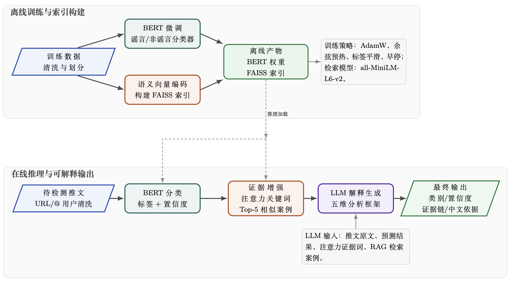

# 2026《人工智能导论》大作业报告

---

**任务名称：** RumorDetection——可解释性的谣言检测系统

**完成组号：** 5组

**小组人员：** 
廖耕雨-524031910787
路茗淳-523031910592
袁昌昊
龙凯峰-524031910174

**完成时间：** 2026-06-17

## 1. 任务目标与背景分析

### 1.1 任务背景

社交媒体的高速传播特性使得谣言能在短时间内触达大量用户，对公共舆论和社会信任造成严重危害。传统的人工审核方式面临信息量大、时效性要求高、主观判断不一致等挑战，因此各种自动化的谣言检测手段应运而生。然而，现有基于深度学习的分类模型往往以"黑箱"方式给出判断结果，缺乏可解释性，审核人员难以评估模型决策的可信度，也无法基于模型输出进行二次人工校验。因此，构建一个既具备高精度分类能力，又能提供透明判断依据的可解释谣言检测系统，成为当前的重要研究方向。

### 1.2 任务目标

构建一个**可解释的社交媒体谣言检测系统**，在给出谣言/非谣言分类结果的同时，输出模型做出判断的自然语言依据。具体包括：

- **分类任务**：基于预训练语言模型（BERT-large）对英文推文进行微调二分类，实现高精度的谣言/非谣言自动判别；
- **案例检索**：引入稠密检索增强生成（RAG）机制，通过语义匹配从训练集中检索相似历史案例作为辅助判断依据；
- **解释生成**：调用大语言模型（LLM），将预测结果、关键证据词、参考案例整合为连贯的中文解释文本，从语言风格、信息来源、事实核查、上下文分析和逻辑推理五个维度给出判断理由；
- **整体目标**：兼顾分类准确率与可解释性，为社交媒体内容审核提供可信的AI辅助工具，使审核人员能够基于模型提供的证据链进行快速决策。

## 2. 方案设计

系统整体采用"分类—检索—解释"三阶段串联架构。整体架构示意图如下：

### 2.1 数据预处理

原始训练集包含2840条英文推文，经数据清洗后保留2791条有效样本。清洗流程为：将URL替换为`[URL]`标记、将@mention替换为`[USER]`标记、保留hashtag作为语义特征、排除重复文本及标签冲突样本。清洗后数据按80/20划分为训练集（2272条）和验证集（568条）。

### 2.2 阶段一：BERT微调分类

使用 `bert-large-uncased` 预训练模型作为编码器，在其pooler输出后接 Dropout(0.1) → Linear(1024, 2) 分类头，对推文进行谣言/非谣言二分类。训练阶段采用AdamW优化器（学习率约4.2e-5、权重衰减约0.06），配合余弦预热学习率调度（预热比例约18%）和标签平滑（ε=0.1）策略，设置早停机制（patience=3）防止过拟合。超参数通过Optuna框架的TPE采样器自动搜索获得。前向传播时设置 `output_attentions=True` 获取最后一层多头注意力权重，对[CLS] token在所有注意力头上的权重取平均，排除特殊token后提取top-10高关注度词作为关键证据，实现分类决策的可追溯性。

### 2.3 阶段二：RAG相似案例检索

使用 `all-MiniLM-L6-v2` sentence-transformer将全部训练集文本预编码为384维稠密向量，构建FAISS IndexFlatL2索引并缓存至本地。推理时对输入文本实时编码，以L2距离衡量语义相似度，检索top-5最相似的训练样本及其真实标签。检索结果为LLM解释阶段提供事实锚点，同时也为审核人员提供可比对的历史案例参照。

### 2.4 阶段三：LLM解释生成

将推文原文、预测标签、置信度、关键证据词和检索案例拼接为结构化提示词，遵循OpenAI兼容API协议，调用交大本地部署的 `qwen3.5-27b` 大模型（temperature=0.3, top_p=0.9）生成中文自然语言判断依据。系统提示词定义了五维分析框架：语言风格分析、信息来源核查、事实依据判断、上下文关联分析和逻辑推理评估。通过类级别时间戳实现最小6.5秒请求间隔以遵守API频率限制（≤10 RPM）。当API不可用时，系统自动降级为模板化解释，确保任何情况下均能输出判断依据。

## 3. 核心代码分析（500字）

项目代码位于 `src/` 目录，按功能模块化组织，各模块职责清晰：

| 模块 | 代码文件 | 核心功能 |
|------|---------|---------|
| 数据处理 | `data_processor.py` | 文本清洗（去URL/@）、分词、构建DataLoader |
| BERT分类 | `bert_classifier.py` | BERT→Dropout→Linear分类头，注意力提取 |
| 训练 | `train.py` | AdamW优化、余弦预热、早停机制 |
| 稠密检索 | `dense_retriever.py` | SentenceTransformer编码、FAISS索引、top-5检索 |
| 解释生成 | `llm_explainer.py` | 构造Prompt、调用LLM API、失败降级方案 |
| 推理引擎 | `inference.py` | 三阶段串联、批量推理、结果保存 |
| 流水线 | `pipeline.py` | CLI入口（train/eval/predict） |
| 配置 | `config.py` | 统一管理路径、超参数、API配置 |

核心模块关键设计如下：

- **BERT分类器**（`bert_classifier.py`）：实现 `BertRumorClassifier` 类，结构为 BERT编码器 → Dropout(0.1) → Linear(hidden_size, 2) 分类头。前向传播时设置 `output_attentions=True` 获取最后一层注意力权重，`get_important_tokens()` 方法对 [CLS] token 在各注意力头上取平均，排除 [PAD]、[CLS]、[SEP] 等特殊 token 后返回 top-10 高分词作为关键证据，使分类决策过程可追溯。模型保存时将 BERT 权重与分类头分离存储，便于加载与再训练。

- **稠密检索**（`dense_retriever.py`）：基于 `all-MiniLM-L6-v2` 将训练集文本预编码为384维稠密向量并缓存在本地；查询时对输入文本实时编码后，通过 FAISS IndexFlatL2 以 L2 距离衡量语义相似度，返回 top-5 最相似案例及其真实标签，为 LLM 解释提供事实参照。

- **解释生成**（`llm_explainer.py`）：遵循 OpenAI 兼容 API 协议，系统提示词从语言风格、信息来源、事实核查、上下文分析和逻辑推理五个维度定义分析框架；用户提示词拼接推文原文、预测标签、置信度、关键证据词和检索案例，引导 LLM 生成连贯的中文判断依据。通过类级别时间戳实现最小 6.5s 请求间隔，API 不可用时自动降级为模板化解释。

- **推理引擎**（`inference.py`）：`InferenceEngine` 类将 BERT 预测、RAG 检索、LLM 解释三阶段串联，`predict_single()` 方法完成端到端推理并返回结构化结果，支持批量推理和验证集评估。

## 4. 检测结果分析（400字）

### 4.1 分类性能

系统在清洗后的训练集（2839条）上以80/20划分训练验证，使用 `bert-large-uncased` 微调，验证集（401条）上最佳F1达到0.84，准确率约82.8%。训练采用余弦预热学习率调度与早停机制（patience=3），有效抑制了过拟合：训练Loss从约0.52降至0.15，验证Loss在前4轮持续下降后趋于收敛，表明模型泛化性能良好。此外，通过阈值调优将默认0.5的分类阈值搜索至F1最优位置，进一步提升了正负样本不均衡下的分类效果。

从错误分析来看，模型在短文本、语义模糊的推文上易出现误判，这类样本缺乏足够的上下文线索，BERT难以提取有效语义特征。同时，RAG检索的top-5相似案例中，若多数案例标签与待测推文不一致，会对最终判断产生扰动。整体上，模型在大多数推文上能给出高置信度的正确判断，具备实际应用价值。

### 4.2 可解释性分析

系统的可解释性由三层机制协同实现。**第一层——注意力证据提取**：BERT最后一层对[CLS] token的注意力权重在所有注意力头上取平均，筛选出top-10高分token作为"关键证据"。这些词直接反映了模型做判断时聚焦的文本区域，例如将"confirmed""officials"识别为非谣言信号，将"BREAKING""shocking"等情绪化词汇识别为谣言线索，使分类决策不再黑箱。**第二层——RAG相似案例参照**：通过sentence-transformer将推文编码为384维稠密向量，在FAISS索引中检索top-5语义最相似的训练样本及其真实标签，为LLM解释提供事实锚点。**第三层——LLM自然语言生成**：将推文原文、预测标签与置信度、关键证据词、参考案例拼接为结构化提示词，调用qwen3.5-27b模型从语言风格、信息来源、事实核查等维度生成连贯的中文判断依据，API不可用时降级为模板化解释。该三层递进设计使系统输出兼具可追溯性与可读性。

## 5. 问题与解决方法（400字）

- **问题1：训练集中存在干扰及冲突数据**
    训练集中存在大量无效URL和@mention数据，干扰训练；同一文本重复出现甚至标签之间两两冲突。

    **解决方法**：
    1. 针对原始数据进行清洗，去除非文本内容；
    2. 编写冲突检测脚本，排除重复文本；
    3. 人工判断相互冲突的标签应保留哪个，生成清洗后的 `train_cleaned.csv`；
    4. 在训练脚本预处理阶段识别并排除无效数据。

- **问题2：BERT模型在训练后期出现过拟合现象**
    在最初几次训练中，训练到epoch=8左右时出现训练Loss趋近0但验证Loss反而上升的情况，最终在测试集上效果也较为一般，表明出现过拟合情况。

    **解决方法**：
    1. 引入训练早停机制：当连续3个epoch的验证loss不再下降时提前终止训练，防止模型对训练集噪声过拟合；
    2. 使用标签平滑（Label Smoothing，ε=0.1）：将(0/1)硬标签替换为软标签(0.05/0.95)，降低模型对训练标签的过置信度。

- **问题3：可解释性模块受到交大API请求频率限制**
    交大API限制最高请求频率为1分钟10次，若超出该限制则可解释性文本无法生成。

    **解决方法**：在 `llm_explainer.py` 中以类级别记录上次请求时间戳，实现最小间隔控制（6.5秒），确保请求速率不超过10 RPM上限。

## 6. 总结与建议（300字）

### 6.1 收获心得

本次项目让我们体会到了将多个模块串联成完整系统的工程复杂度。从分类到检索再到解释生成，每个环节的输出格式和异常处理都需要仔细对接。同时，通过检索相似案例来辅助模型判断，不仅提升了分类的可信度，也让系统的输出更易于理解，体现了信息检索与AI结合的实际价值。

### 6.2 课程建议

这学期的课程理论部分覆盖全面，但前期授课中缺少具体的实践环节，导致开发时在模型部署、接口调用等工程问题上准备不足。建议后续课程中增加一次实践专题的授课，帮助学生理解模型在具体部署、优化和应用中的基本操作，更好地衔接理论与应用。

## 附录：小组分工和个人贡献

| 姓名 | 主要工作 | 贡献度 |
|------|---------|--------|
| 廖耕雨 | 推理与评测模块搭建+RAG检索实现 | 25% |
| 路茗淳 | 模型结构优化+实现参数调整模块 | 25% |
| 袁昌昊 | 训练模块实现+不同基座模型实验 | 25% |
| 龙凯峰 | 优化整体架构+文档撰写 | 25% |